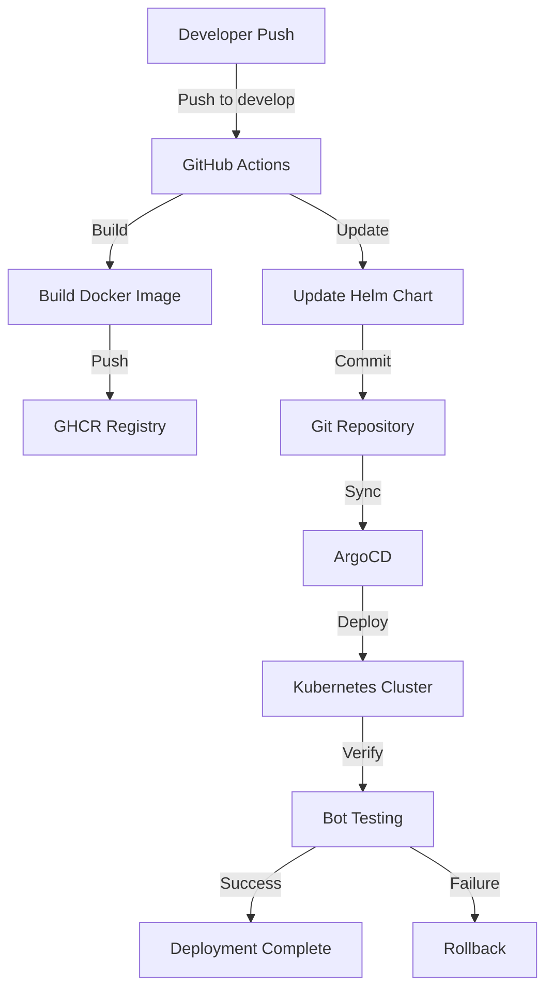

## USAGE

# Інструкції з використання kbot

Цей документ описує, як використовувати `Makefile` та `Dockerfile` для збірки, тестування, створення Docker-образів та керування проектом `kbot`.

## Зміст
1.  [Передумови](#1-передумови)
2.  [Огляд Makefile](#2-огляд-makefile)
    * [Основні змінні](#основні-змінні)
    * [Цілі Makefile](#цілі-makefile)
3.  [Огляд Dockerfiles](#3-огляд-dockerfiles)
    * [`Dockerfile.builder`](#dockerfilebuilder)
    * [`Dockerfile` (для фінальних образів)](#dockerfile-для-фінальних-образів)
4.  [Робочі процеси та приклади команд](#4-робочі-процеси-та-приклади-команд)
    * [Збірка бінарного файлу для конкретної платформи (через Docker)](#збірка-бінарного-файлу-для-конкретної-платформи-через-docker)
    * [Збірка образу для запуску (конкретна платформа)](#збірка-образу-для-запуску-конкретна-платформа)
    * [Запуск тестів](#запуск-тестів)
    * [Очищення артефактів збірки та Docker-образів](#очищення-артефактів-збірки-та-docker-образів)
    * [Публікація образу в регістр](#публікація-образу-в-регістр)
    * [Збірка багатоархітектурного Docker-образу для публікації (рекомендовано)](#збірка-багатоархітектурного-docker-образу-для-публікації-рекомендовано)
5.  [Важливі примітки](#5-важливі-примітки)

## 1. Передумови

Перед початком роботи переконайтеся, що у вас встановлені наступні інструменти:

* **Make**: Утиліта GNU Make.
* **Docker**: Остання версія з підтримкою `buildx` для багатоархітектурних збірок.
* **Git**: Для визначення версії програми.
* **Go**: Хоча основна компіляція відбувається в Docker, локально встановлений Go (версії, зазначеної в `GO_VERSION_REQ` у Makefile, наприклад, 1.22) може бути корисним для запуску тестів (`make test`) та інших локальних операцій з Go.

## 2. Огляд Makefile

`Makefile` автоматизує процес збірки бінарних файлів (використовуючи Docker), створення фінальних Docker-образів та їх публікації.

### Основні змінні

* `GO_VERSION_REQ`: Мінімально необхідна версія Go (наприклад, `1.22`), актуальна для локальних операцій, таких як `make test`.
* `REPO`: Префікс репозиторію для Docker-образів (наприклад, `github.dev/devops101-prom`).
* `VERSION`: Автоматично визначається на основі тегів Git та хешу коміту (наприклад, `v1.0.0-g1a2b3c4`).
* `APP_NAME`: Назва програми (`kbot`).
* `OUTPUT_DIR`: Директорія для збереження скомпільованих бінарних файлів (`./bin`).
* `TARGET_PLATFORMS`: Список підтримуваних комбінацій ОС/архітектура для збірки бінарних файлів.
* `CURR_OS`, `CURR_ARCH`: Автоматично визначені поточна операційна система та архітектура хоста, використовуються для визначення платформи виконання збірки `Dockerfile.builder`.
* `IMG-RM`: Якщо встановлено в `true` при виконанні `make clean` (наприклад, `make clean IMG-RM=true`), будуть видалені локальні Docker-образи, що відповідають `$(REPO)/$(APP_NAME):$(VERSION)*`.

### Цілі Makefile

* **`all` (ціль за замовчуванням)**:
    * Відображає список дозволених комбінацій ОС/архітектура (`TARGET_PLATFORMS`) для збірки бінарних файлів.

* **`<os>/<arch>` (наприклад, `make linux/amd64`, `make windows/arm64`)**:
    * Ця ціль збирає бінарний файл `kbot` для вказаної операційної системи (`os`) та архітектури (`arch`).
    * **Процес збірки**:
        1. Збирає тимчасовий Docker-образ за допомогою `Dockerfile.builder`. Платформа виконання цієї збірки визначається змінними `CURR_OS`/`CURR_ARCH` (тобто платформа хоста), але всередині цього образу Go компілює код для цільових `$(1)` (ОС) та `$(2)` (архітектура). Образ тегується як `$(APP_NAME):$(VERSION)`.
        2. Створює тимчасовий контейнер з образу `$(APP_NAME):$(VERSION)`.
        3. Копіює скомпільований бінарний файл `/app/bin/$(APP_NAME)` з контейнера в локальну директорію `$(OUTPUT_DIR)/$(APP_NAME)-$(1)-$(2)`.
        4. Видаляє тимчасовий контейнер.
    * Результат: бінарний файл у `$(OUTPUT_DIR)`.

* **Аліаси для зручності (для збірки бінарних файлів)**:
    * `make linux`: Збирає бінарний файл для `linux/amd64`.
    * `make arm`: Збирає бінарний файл для `linux/arm64`.
    * `make windows`: Збирає бінарний файл для `windows/amd64`.
    * `make macos`: Збирає бінарний файл для `darwin/arm64` (зверніть увагу, що аліас `macos` у вашому Makefile вказує на `darwin/arm64`, а не `darwin/amd64`).

* **`image`**:
    * Збирає Docker-образ для `linux/amd64` за допомогою `Dockerfile` (ймовірно, `Dockerfile.multiarch.runnable`).
    * Образ тегується як `$(REPO)/$(APP_NAME):$(VERSION)`.

* **`image-arm`**:
    * Збирає Docker-образ для `linux/arm64` за допомогою `Dockerfile`.
    * Образ тегується як `$(REPO)/$(APP_NAME):$(VERSION)`.

* **`image-macos`**:
    * Збирає Docker-образ для `darwin/arm64` за допомогою `Dockerfile`.
    * Образ тегується як `$(REPO)/$(APP_NAME):$(VERSION)`.
    * **Увага**: Docker зазвичай не запускає macOS-контейнери. Ця ціль, ймовірно, призначена для збірки образу, який містить бінарний файл для macOS, але сам образ буде на базі Linux, якщо `Dockerfile` не обробляє це специфічно.

* **`image-windows`**:
    * Збирає Docker-образ для `windows/amd64` за допомогою `Dockerfile`.
    * Образ тегується як `$(REPO)/$(APP_NAME):$(VERSION)`.

* **`test`**:
    * Запускає тести Go (`go test -v ./...`). Вимагає наявності Go та залежностей у локальному середовищі.

* **`docker-push`**:
    * Публікує Docker-образ `$(REPO)/$(APP_NAME):$(VERSION)` в регістр. Це означає, що перед цим має бути зібраний образ за допомогою однієї з цілей `image*`.

* **`clean`**:
    * Видаляє директорію з артефактами збірки (`$(OUTPUT_DIR)`).
    * Якщо `IMG-RM=true`, також видаляє локальні Docker-образи, що відповідають `$(REPO)/$(APP_NAME):$(VERSION)*`.

## 3. Огляд Dockerfiles

Для роботи цього `Makefile` очікується наявність двох Dockerfile:

### `Dockerfile.builder`

* **Призначення**: Цей Dockerfile використовується цілями `<os>/<arch>` у `Makefile` для компіляції Go-додатку `kbot` для конкретної цільової операційної системи (`TARGETOS`) та архітектури (`TARGETARCH`).
* **Процес**:
    1.  Приймає аргументи `TARGETOS` та `TARGETARCH`.
    2.  Базується на образі `golang` (наприклад, `golang:1.22-alpine`).
    3.  Копіює вихідний код проекту.
    4.  Виконує `go build` з відповідними `GOOS=${TARGETOS}` та `GOARCH=${TARGETARCH}`.
    5.  Скомпільований бінарний файл зазвичай розміщується у відомому місці всередині образу (наприклад, `/app/bin/$(APP_NAME)`), звідки його потім копіює `Makefile`.

### `Dockerfile` (для фінальних образів)

* **Призначення**: Цей Dockerfile (ймовірно, той, що раніше називався `Dockerfile.multiarch.runnable`) використовується цілями `image*` у `Makefile` для створення фінальних, оптимізованих та готових до запуску Docker-образів для `kbot`.
* **Рекомендована структура (багатоетапна та багатоплатформна)**:
    1.  **`builder` етап (може бути схожим або тим самим, що й у `Dockerfile.builder`, або використовувати `Makefile` для компіляції)**: Компілює додаток.
    2.  **`final_linux` етап**: На базі легко_вагового Linux-образу (наприклад, `alpine`), копіює бінарний файл для Linux, встановлює `ENTRYPOINT`.
    3.  **`final_windows` етап**: На базі Windows-образу (наприклад, `nanoserver`), копіює `.exe` файл для Windows, встановлює `ENTRYPOINT`.
    4.  **`final` етап (селектор)**: Використовує `FROM final_${TARGETOS}` для автоматичного вибору правильного фінального образу на основі `--platform`, переданого в `docker buildx build`.

## 4. Робочі процеси та приклади команд

### Збірка бінарного файлу для конкретної платформи (через Docker)

Для збірки бінарного файлу (наприклад, для `linux/amd64`):
```bash
make linux/amd64
```
Результат буде в `./bin/kbot-linux-amd64`.

Або використовуйте аліас:
```bash
make linux
```

### Збірка образу для запуску (конкретна платформа)

Для збірки Docker-образу для `linux/amd64` (тег: `$(REPO)/$(APP_NAME):$(VERSION)`):
```bash
make image
```

Для `linux/arm64`:
```bash
make image-arm
```
І так далі для `image-macos`, `image-windows`.

### Запуск тестів
```bash
make test
```
*(Переконайтеся, що Go та залежності встановлені локально)*

### Очищення артефактів збірки та Docker-образів
Для видалення директорії `./bin`:
```bash
make clean
```
Для видалення `./bin` та пов'язаних Docker-образів:
```bash
make clean IMG-RM=true
```

### Публікація образу в регістр
1.  Зберіть образ за допомогою однієї з цілей `image*`, наприклад:
    ```bash
    make image
    ```
2.  Опублікуйте образ:
    ```bash
    make docker-push
    ```
    **Увага**: Ця команда опублікує образ `$(REPO)/$(APP_NAME):$(VERSION)`. Якщо ви зібрали образи для різних архітектур за допомогою `make image-arm` і т.д., вони всі будуть мати однаковий тег, що може призвести до перезапису в регістрі, якщо він не підтримує маніфести для одного тегу. Див. наступний пункт.

### Збірка багатоархітектурного Docker-образу для публікації (рекомендовано)

Для створення справжнього багатоархітектурного образу (один тег, що вказує на різні образи для різних архітектур), використовуйте `docker buildx` безпосередньо з вашим фінальним `Dockerfile` (який підтримує багатоплатформність). `Makefile` у поточному вигляді не збирає багатоархітектурний маніфест автоматично.

Приклад команди (поза `Makefile`):
```bash
# Спочатку увійдіть у ваш регістр, наприклад: docker login ghcr.io
VERSION_TAG=$(git describe --tags --abbrev=0)-$(git rev-parse --short HEAD)
IMAGE_NAME_WITH_REPO="github.dev/devops101-prom/kbot" # Замініть на ваш регістр

docker buildx build \
  --platform linux/amd64,linux/arm64,windows/amd64 \
  -t "${IMAGE_NAME_WITH_REPO}:${VERSION_TAG}" \
  -t "${IMAGE_NAME_WITH_REPO}:latest" \
  -f Dockerfile . --push # Переконайтесь, що 'Dockerfile' - це ваш багатоплатформний Dockerfile
```

## 5. Важливі примітки

* **Імена Dockerfile**: `Makefile` посилається на `Dockerfile.builder` (для видобування бінарних файлів) та `Dockerfile` (для цілей `image*`). Переконайтеся, що ці файли існують у корені проекту та мають відповідний вміст.
* **Версіонування Git**: Визначення версії в `Makefile` (`VERSION=...`) вимагає наявності Git-тегів та історії комітів.
* **Тегування Docker-образів**:
    * Цілі `<os>/<arch>` створюють тимчасовий образ `$(APP_NAME):$(VERSION)` для видобування бінарника. Цей тег може перезаписуватися.
    * Цілі `image*` створюють образ `$(REPO)/$(APP_NAME):$(VERSION)`. Якщо ви запускаєте `make image`, потім `make image-arm`, вони обидва намагатимуться створити/перезаписати той самий тег, якщо тільки ваш `Dockerfile` та `docker buildx` не налаштовані для створення маніфесту. Для справжньої багатоархітектурної збірки під одним тегом використовуйте команду `docker buildx build --platform ... --push` безпосередньо.
* **Локальні тести**: Ціль `make test` виконує `go test` локально. Це вимагає встановленого Go та всіх залежностей у вашому середовищі.
* **Ціль `macos`**: Аліас `macos` у `Makefile` вказує на `darwin/arm64`. Переконайтеся, що це бажана поведінка.
* **Залежності**: Ціль `install-dep` у поточному `Makefile` порожня. Залежності Go повинні бути або в `go.mod` і оброблятися командами `go build`/`go test`, або керуватися всередині `Dockerfile.builder`.

# KBot - Telegram Бот

KBot - це CLI-додаток, створений за допомогою Cobra, який запускає Telegram-бота, реалізованого на бібліотеці Telebot. Бот надає набір команд для взаємодії з користувачами.

## Опис

Цей застосунок є інструментом для запуску Telegram-бота `KBot`. Він використовує бібліотеку Cobra для управління командами командного рядка та Telebot для взаємодії з Telegram API.

### Адреса бота: t.me/tirthika_bot

## Можливості

* **Інтерфейс командного рядка**: Керування ботом через команди CLI.
* **Telegram Бот**:
    * Відповідає на команду `/start` вітальним повідомленням.
    * Відповідає на команду `/hello` персоналізованим привітанням.
    * Надає список доступних команд за допомогою `/help`.
    * Показує версію програми за командою `/version`.
    * Відповідає "pong" на команду `/ping`.
    * Реагує на будь-який інший текст повідомленням-заглушкою.

## Передумови

* Встановлений [Go](https://golang.org/dl/) (версія 1.16+ рекомендується).
* Токен Telegram Бота (отриманий від [@BotFather](https://t.me/BotFather)).

## Встановлення

1.  Клонуйте репозиторій (якщо він існує):
    ```bash
    git clone <URL_ВАШОГО_РЕПОЗИТОРІЮ>
    cd <НАЗВА_ПРОЕКТУ>
    ```
2.  Встановіть залежності:
    ```bash
    go mod tidy
    ```

## Конфігурація

Перед запуском бота, вам необхідно встановити змінну середовища `TELE_TOKEN`, яка міститиме токен вашого Telegram-бота:

```bash
export TELE_TOKEN="ВАШ_ТЕЛЕГРАМ_ТОКЕН_ТУТ"
```

## Використання

Для запуску бота виконайте наступну команду:

```bash
go run main.go kbot
# або якщо ви скомпілювали проект:
# ./<назва_скомпільованого_файлу> kbot
```

Після запуску, консоль виведе повідомлення про старт бота, і він почне обробляти команди в Telegram.

Приклад:
```bash
go run main.go kbot
# Або, якщо ваш головний файл називається інакше, наприклад app.go:
# go run app.go kbot
```
kbot vX.Y.Z started
```
(де `vX.Y.Z` - це значення змінної `appVersion`)

## Доступні команди бота в Telegram

Після запуску бота, ви можете взаємодіяти з ним у Telegram за допомогою наступних команд:

* `/start` - Почати взаємодію з ботом.
* `/help` - Ця команда виводить перелік команд, які приймає Kbot.
* `/version` - Показує версію програми Kbot.
* `/hello` - Поверне вітальне значення.
* `/ping` - Відповідає "pong".

## Структура CLI команд (Cobra)

* `kbot` (або `start`): Основна команда для запуску Telegram-бота.

## CI/CD Solutions

The project supports two CI/CD solutions: GitHub Actions and Jenkins pipeline. You can choose either based on your needs.

### GitHub Actions CI/CD Pipeline



#### Pipeline Components

1. **GitHub Actions Workflow**
   - Triggers on push to develop branch
   - Builds multi-arch Docker images
   - Pushes to GitHub Container Registry
   - Updates Helm chart version
   - Triggers ArgoCD sync

2. **Docker Image**
   - Multi-arch support (amd64, arm64)
   - Versioned with git tags and commit hashes
   - Stored in GitHub Container Registry

3. **Helm Chart**
   - Automated version updates
   - Configurable through values.yaml
   - Deployed via ArgoCD

4. **ArgoCD**
   - Automated sync on changes
   - Self-healing capabilities
   - Health monitoring

#### Getting Started with GitHub Actions

1. Clone the repository:
   ```bash
   git clone https://github.com/DEVOPS101-PROM/kbot.git
   cd kbot
   ```

2. Set up your Telegram bot token:
   ```bash
   # Update values.yaml with your token
   helm upgrade --install kbot ./helm \
     --set telegram.token=your-token
   ```

3. Deploy using ArgoCD:
   ```bash
   kubectl apply -f argocd/kbot-app.yaml
   ```

#### Development with GitHub Actions

1. Create a new branch from develop:
   ```bash
   git checkout -b feature/your-feature develop
   ```

2. Make your changes and commit:
   ```bash
   git add .
   git commit -m "Your commit message"
   git push origin feature/your-feature
   ```

3. Create a pull request to develop branch

#### CI/CD Process with GitHub Actions

1. Push to develop branch triggers workflow
2. GitHub Actions builds and pushes Docker image
3. Helm chart version is updated automatically
4. ArgoCD detects changes and syncs deployment
5. Bot is tested automatically
6. Deployment is verified

### Jenkins Pipeline

The project also includes a Jenkins pipeline for automated building, testing, and deployment. The pipeline supports multi-platform builds and integrates with GitHub Container Registry (GHCR).

#### Pipeline Features

* **Parameterized Builds**:
  * Target OS selection (linux, darwin, windows)
  * Target architecture selection (amd64, arm64)
  * Container runtime selection (docker, podman)
  * Default values: linux/amd64 with docker

* **Build Process**:
  1. Checks out the source code
  2. Authenticates with GHCR
  3. Builds the Docker image for the selected platform
  4. Pushes the image to GHCR
  5. Updates the Helm chart with the new image tag

#### Jenkins Setup Instructions

1. **Jenkins Credentials**:
   - Go to Jenkins Dashboard
   - Navigate to "Manage Jenkins" > "Manage Credentials"
   - Click on "System" > "Global credentials" > "Add Credentials"

2. **Required Credentials**:

   a. **GitHub Container Registry (GHCR) Credentials**:
   ```
   Kind: Username with password
   ID: ghcr-credentials
   Username: your-github-username
   Password: your-github-pat
   Description: GitHub Container Registry Credentials
   ```

   b. **GitHub Repository Credentials** (if using private repo):
   ```
   Kind: Username with password
   ID: github-repo-credentials
   Username: your-github-username
   Password: your-github-pat
   Description: GitHub Repository Credentials
   ```

   c. **Kubernetes Cluster Credentials**:
   ```
   Kind: Kubernetes configuration (kubeconfig)
   ID: k8s-credentials
   Kubeconfig: your-kubeconfig-content
   Description: Kubernetes Cluster Credentials
   ```

3. **Setting Up Environment Variables**:

   a. **Global Environment Variables**:
   - Go to "Manage Jenkins" > "Configure System"
   - Find "Global properties" section
   - Check "Environment variables"
   - Add the following variables:
     ```
     DOCKER_REGISTRY=ghcr.io
     DOCKER_IMAGE=devops101-prom/kbot
     HELM_CHART_DIR=helm
     HELM_RELEASE_NAME=kbot
     ```

   b. **Pipeline-specific Variables**:
   - In your pipeline job configuration
   - Under "Build Environment" section
   - Check "Inject environment variables"
   - Add variables in properties file format:
     ```
     TARGET_OS=linux
     TARGET_ARCH=amd64
     CONTAINER_RUNTIME=docker
     HELM_NAMESPACE=default
     ```

4. **Using Secrets in Pipeline**:

   a. **In Jenkinsfile**:
   ```groovy
   withCredentials([usernamePassword(
       credentialsId: 'ghcr-credentials',
       usernameVariable: 'DOCKER_USERNAME',
       passwordVariable: 'DOCKER_PASSWORD'
   )]) {
       // Use DOCKER_USERNAME and DOCKER_PASSWORD here
   }
   ```

   b. **In Shell Scripts**:
   ```groovy
   withCredentials([string(credentialsId: 'secret-id', variable: 'SECRET_VAR')]) {
       sh '''
           echo $SECRET_VAR > secret.txt
       '''
   }
   ```

5. **Security Best Practices**:

   - Never store secrets in Jenkinsfile or job configurations
   - Use credential IDs instead of hardcoded values
   - Rotate credentials regularly
   - Use least privilege principle for credentials
   - Enable credential masking in console output
   - Use separate credentials for different environments

6. **Troubleshooting**:

   a. **Credential Not Found**:
   - Verify credential ID matches exactly
   - Check if credential is in the correct scope (System/Global)
   - Ensure Jenkins has permission to access the credential

   b. **Variable Not Set**:
   - Check if variable is defined in the correct scope
   - Verify variable name matches exactly
   - Check if variable is injected before use

   c. **Permission Issues**:
   - Verify Jenkins user has necessary permissions
   - Check credential permissions
   - Review Jenkins security settings

7. **Example Configuration**:

   a. **Complete Credential Setup**:
   ```groovy
   // In Jenkinsfile
   environment {
       DOCKER_REGISTRY = credentials('docker-registry')
       DOCKER_IMAGE = credentials('docker-image')
       GITHUB_TOKEN = credentials('github-token')
   }
   ```

   b. **Using Multiple Credentials**:
   ```groovy
   withCredentials([
       usernamePassword(credentialsId: 'ghcr-credentials', 
                       usernameVariable: 'DOCKER_USERNAME', 
                       passwordVariable: 'DOCKER_PASSWORD'),
       string(credentialsId: 'telegram-token', 
              variable: 'TELEGRAM_TOKEN')
   ]) {
       // Use credentials here
   }
   ```

Remember to:
- Keep credentials secure and never commit them to version control
- Use different credentials for different environments
- Regularly audit and rotate credentials
- Follow the principle of least privilege
- Document all credential IDs and their purposes

## Monitoring

- ArgoCD dashboard for deployment status
- Kubernetes dashboard for pod status
- Bot functionality testing after deployment

## Contributing

1. Fork the repository
2. Create your feature branch
3. Commit your changes
4. Push to the branch
5. Create a Pull Request

